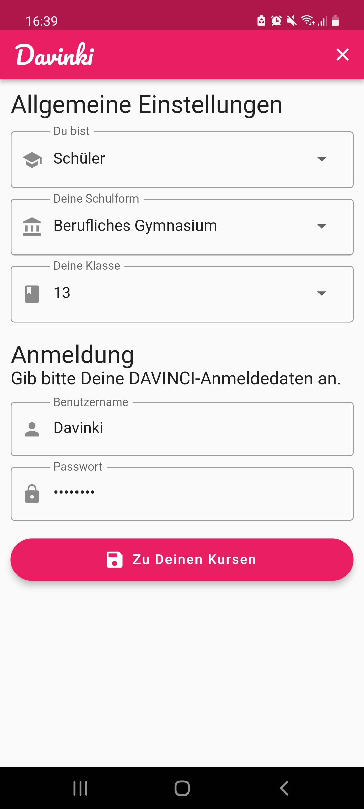
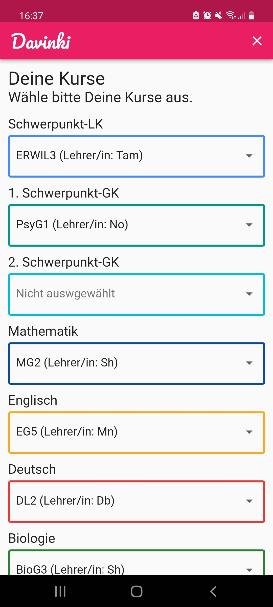
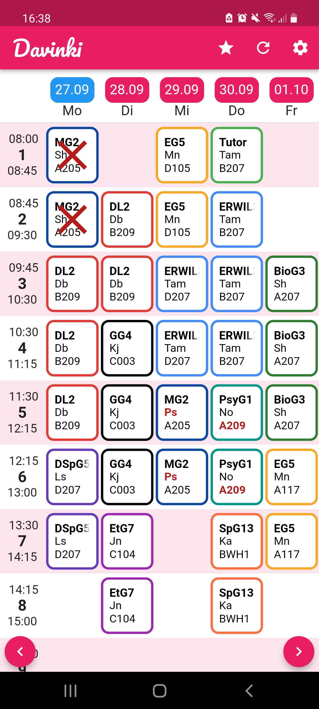
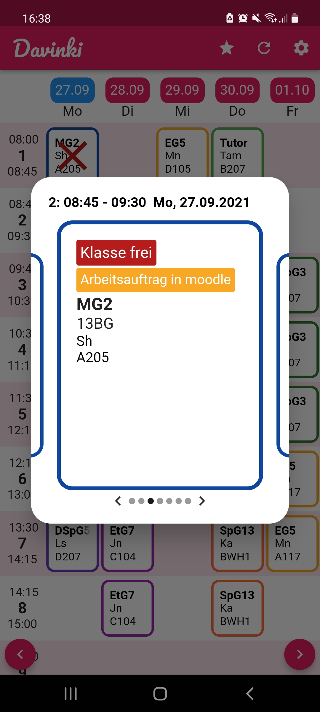

<br/>

<p align="center">
    
    <br />
    <strong>
        Die bessere Stundenplan-App für die Brühlwiesenschule in Hofheim
    </strong>
</p>

<p align="center">
    <a href="https://flutter.dev/">
        
    </a>
    <a href="https://github.com/SH1RL0CK/davinki/releases/latest">
        
    </a>
    <a href="https://github.com/SH1RL0CK/davinki/releases/latest">
        
    </a>
    <a href="https://sh1rl0ck.github.io/davinki/">
        
    </a>
</p>
<hr />

## 📝 Inhalt
- [Was ist Davinki?](#-was-ist-davinki)
- [Wie funktioniert die App?](#-wie-funktioniert-die-app)
- [Wie sieht die App aus?](#%EF%B8%8F-wie-sieht-die-app-aus)
- [Wie kann ich die App installieren?](#-wie-kann-ich-die-app-installieren)
    - [Android](#-android)
    - [iOS](#-ios)
- [Gibt es auch eine Web App?](#-gibt-es-auch-eine-web-app)
- [Wie kann ich Bugs melden oder neue Features vorschlagen?](#-wie-kann-ich-bugs-melden-oder-neue-features-vorschlagen)
- [Wie kann ich mitentwickeln?](#-wie-kann-ich-mitentwickeln)

## 💡 Was ist Davinki?
Aktuell verwenden wir in unserer Schule (der Brühlwiesenschule in Hofheim) [DAVINCI](https://davinci.stueber.de/) als Stundenplan-System. Dafür gibt es die [DAVINCI MOBILE App](https://davinci.stueber.de/davinci-mobile.php), wo man sich als Schüler bzw. Lehrer die Stundenpläne anschauen kann und auch Änderungen sieht wie z.B. Vertretungen oder Entfall. Allerdings hat mich an dieser App schon immer einiges gestört:
- Das Design der App ist nicht besonders schön.
- Sie ist langsam und hängt sich auf wenig performanten Geräten sogar auf.
- Man kann nicht direkt seine eigenen Kurse sehen, sondern muss immer nach diesen suchen.

Deswegen habe ich beschlossen, meine eigene, bessere Stundenplan-App für meine Schule zu entwickeln. So ist Davinki entstanden.

## 🏭 Wie funktioniert die App?
Unsere Schule hat einen DAVINCI-Infoserver, von dem sich auch DAVINCI MOBILE seine Daten holt. Mit den DAVINCI-Anmeldedaten, die man beim der ersten Benutzung angibt, kann Davinki auf diesen Server zu greifen. Außerdem gibt man dort Benutzertyp (Schüler oder Lehrer) an, welchen Schulzweig man besucht und welche Klasse.

**(Aktuell unterstützt Davinki nur den Benutzertyp Schüler und nur den Schulzweig Berufliches Gymnasium!)** 

Im nächsten Schritt wählt man dann die Kurse aus, die man belegt. So sieht man beim Aufrufen des Stundenplans auch nur seine Kurse. Trotzdem kann man durch das Klicken auf eine bestimmte Schulstunde auch die Kurse sehen, die parallel stattfinden.

Davinki schreibt außerdem die Daten, die die App von dem DAVINCI-Infoserver erhält, in eine Datei auf dem Gerät. So kann die App auch ohne Internet verwendet werden. Im Offline-Modus werden dann nämlich die Daten von dann angezeigt, als man das letzte Mal mit Internet die App verwendet hat.

## 🖼️ Wie sieht die App aus?
<p align="center">
   
</p>

## 📱 Wie kann ich die App installieren?
### 🤖 Android
Android-Nutzer können sich [hier](https://github.com/sh1rl0ck/davinki/releases/latest) die APK-Datei für die neuste Version von Davinki herunterladen. 

Wenn Du Dich auskennst und weißt, welche Architektur dein Gerät hat, kannst Du die entsprechende Datei wählen. Ansonsten nimm einfach die Datei ohne einen speziellen Zusatz. 

Zum Installieren musst Du einfach die Datei aus deinem Download-Ordner ausführen. Du musst dafür noch die Erlaubnis geben, APK-Dateien aus den "Eigenen Dateien" zu installieren. Warnungen von Google Play kannst Du wegklicken.

Ich versuche außerdem bald, die App im Google Play Store zu veröffentlichen.

### 🍎 iOS
iOS-Nutzer muss ich leider enttäuschen. Bei iOS kann man Apps nur aus dem App Store installieren. Allerdings kostet es 99 US-Dollar pro Jahr, dort Apps zu veröffentlichen und das ist mir zu teuer. Aber Ihr könnt die [Web App](https://sh1rl0ck.github.io/davinki/) verwenden.

## 🌐 Gibt es auch eine Web App?
Ja, Davinki gibt es auch als Web App. Um sie aufzurufen, klicke [hier](https://sh1rl0ck.github.io/davinki/). 

Das Framework Flutter, was ich zum Programmieren der App verwendet habe, ist allerdings für Web Apps noch nicht komplett optimiert und deswegen kann es sein, dass die Web App vor allem auf mobilen Geräten etwas langsam läuft.

## 🐛 Wie kann ich Bugs melden oder neue Features vorschlagen?
Wenn Du in der App einen Bug findest oder du Vorschläge für neue Features hast, kannst Du hier bei GitHub einen neuen sogenannten Issue erstellen. Darin beschreibst Du dann ausführlich Dein Problem oder Deinen Vorschlag und dann kümmere ich mich darum.

## 👨‍💻 Wie kann ich mitentwickeln?
Möchtest Du an Davinki mitentwickeln, musst du Dir dazu Flutter für dein Betriebssystem installieren. Eine Anleitung dafür findest Du [hier](https://flutter.dev/docs/get-started/install). Außerdem solltest Du [Git](https://git-scm.com/) installiert haben.

Als Erstes klone das Repository:
``` bash
git clone https://github.com/SH1RL0CK/davinki
```
Dann navigiere zu dem Davinki-Order:
``` bash
cd /path/to/davinki
```
Danach erstelle das Flutter-Projekt:
``` bash
flutter create ./
```
Und nun kannst Du mit dem Entwickeln loslegen 🚀

[](https://www.youtube.com/watch?v=AxbH_F0sNp4)


